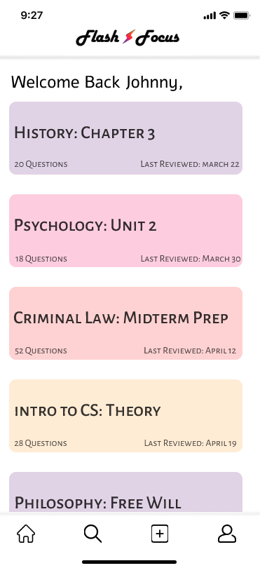
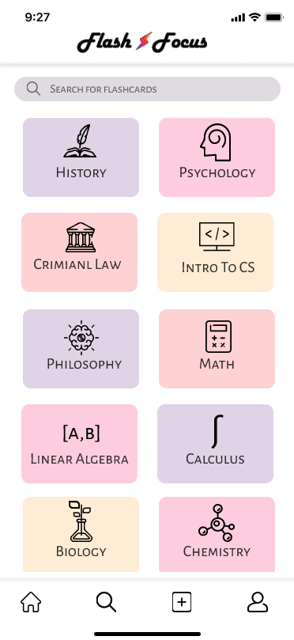
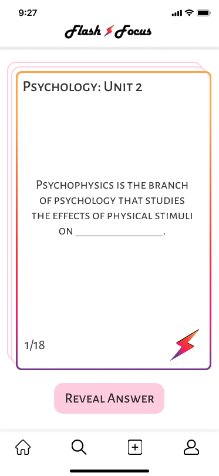

# RUHacks
## Flash-Focus
An app that helps students study efficienly, using active recall. It generates automatic flashcards given an image, document etc.
Not only will this save sudents' time, it will boost their grades.
Learn more with our [Demo Video]()
You can also check out the prototype: [Figma](https://www.figma.com/proto/F65yx46n20XVJP4hzfL5Ls/App?node-id=2%3A158&scaling=min-zoom&page-id=0%3A1)

### Inspiration 💡
Attending class online. Submiting assignments online. Writing tests online. Studying online.
This new reality had lead to the downfall of many, many students grades and motivation.
Even when we want to study, we can't seem to do it right and end up getting low marks. This 
is where Flash Focus comes in. 

### Our solution ⚙️
An app that takes your notes, your readings, websites, articles etc. and automatically generates flashcards for the given topic.
The flashcards are organized to help you consistently review them using a psycologically proven study technique called active recall.
More specifically, it uses space repetition. Plus, the tedious job of creating flashcards manually is eliminated.

### Sneak Peak 👀

  

  

  

  

### How we built it 🛠️
- Google Cloud vision API
- Google Cloud Storage 
- Python
- JavaScript
- HTML
- Rapid API Question Generator
- Flexudy
- Figma

### Challenges we ran into 🚧
Implementing the question generation was tough! We first wated to use Quillionz but were not able to get access to it.
So, the research to find a similar api that does what we need took a long time.
Another challenge was learning to use Google Cloud Vision API but thankfully, the documentation is easy to understand.

### Accomplishments that we're proud of 🌟
1. Successfully learning new API's and implementing them
2. Creating a prototype of an App that can help students, similar to us, struggling with online university. 

### What we learned 📖
Start early and have a solid idea!

### What's next for Flash-Focus! 🚀
The next big thing for Flash-Focus is.... The possibilities for Flash-Focus are endless!

